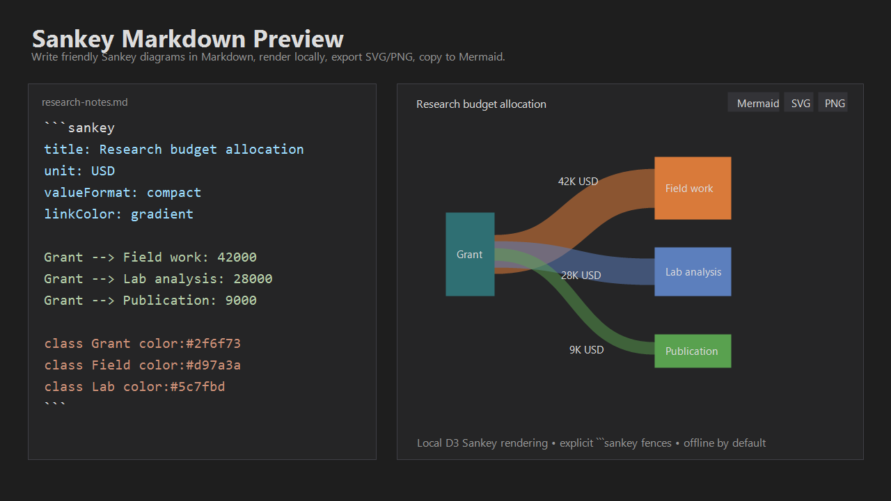
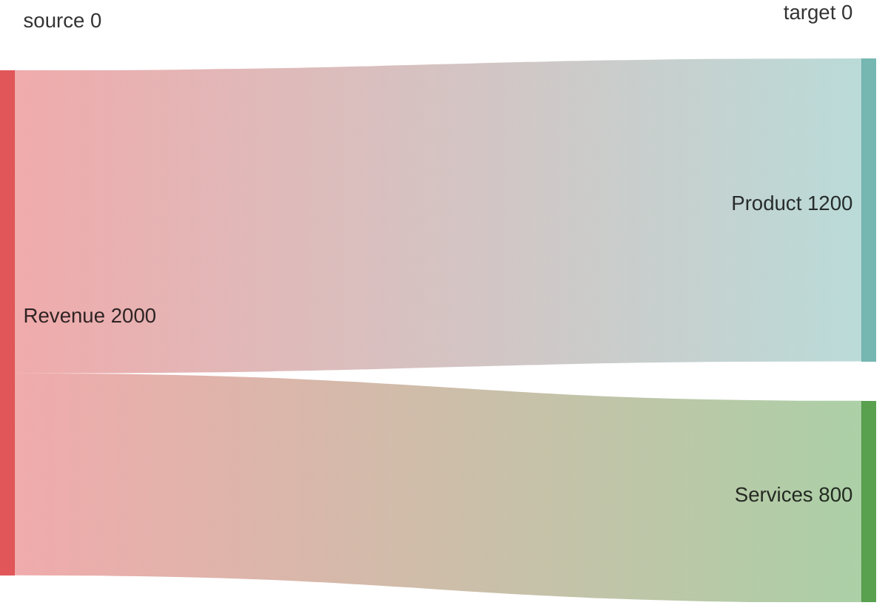

# Sankey Markdown Preview

[](https://marketplace.visualstudio.com/items?itemName=DavidCampbell.sankey-markdown-preview)
[](https://marketplace.visualstudio.com/items?itemName=DavidCampbell.sankey-markdown-preview)
[](https://marketplace.visualstudio.com/items?itemName=DavidCampbell.sankey-markdown-preview&ssr=false#review-details)
[](LICENSE)

A VS Code extension for writing Sankey flow diagrams directly beside Markdown research notes and in standalone `.sankey` files.

The extension renders only explicit `sankey` fenced code blocks in Markdown preview. It does not take over `mermaid` fences or generic code blocks, so it stays compatible with Mermaid-oriented authoring and other Markdown extensions.



## Features

- Friendly Markdown syntax for Sankey diagrams as code
- Local, offline rendering with bundled `d3-sankey`
- Explicit `sankey` fenced code blocks in Markdown preview
- Standalone `.sankey` file preview
- SVG and PNG export from the preview toolbar
- Copy as Mermaid `sankey-beta` for GitHub and Mermaid-compatible docs
- Optional title, unit, value formatting, link color, node alignment, and node colors
- Balance warnings for intermediate nodes where flow does not add up

## When to use Sankey

Use a Sankey diagram when link width should mean something quantitative:

- Energy, water, material, or emissions transfers
- Budget, cost, revenue, or allocation flows
- Product funnels and conversion drop-off
- Dependency or effort flows where magnitude matters

Sankey diagrams are less useful for ordinary process order, dependency topology, or categorical state changes. For those, consider:

- Mermaid flowcharts for process steps and decision paths
- Graphviz for dependency graphs and network structure
- Alluvial-style flow charts for categorical transitions over stages
- Vega, Plotly, or a data app when the chart needs dashboard-level interaction

## Why This Instead of Mermaid Sankey?

Mermaid is the right target when portability is the top priority. This extension is meant for authoring and reviewing Sankey diagrams inside VS Code:

- Write `Source --> Target: 123` instead of Mermaid's CSV rows.
- Keep rich local preview controls without taking over existing `mermaid` blocks.
- Export SVG/PNG directly from the preview.
- Copy Mermaid `sankey-beta` when you need GitHub or static-site portability.
- Stay offline by default with no CDN, Kroki, or remote rendering service.

## Quick Start

````markdown
```sankey
title: Research budget allocation
unit: USD
valueFormat: compact
linkColor: source
nodeAlign: justify

Grant --> Field work: 42000 "travel and local partners"
Grant --> Lab analysis: 28000
Grant --> Publication: 9000

class Grant color:#2f6f73
class Field color:#d97a3a
class Lab color:#5c7fbd
```
````

Open Markdown preview to see the rendered diagram. In `.sankey` files, run **Open Sankey Preview** from the command palette for a dedicated preview pane.

## Example Use Cases

### Energy Flow

```sankey
title: Home energy flow
unit: kWh
linkColor: gradient

Solar --> Battery: 18
Solar --> Grid: 6
Battery --> Home: 14
Grid --> Home: 4
```

### Budget Allocation

```sankey
title: Project budget
unit: USD
valueFormat: compact

Grant --> Research: 42000
Grant --> Equipment: 18000
Grant --> Publication: 9000
```

### Funnel Drop-Off

```sankey
title: Trial funnel
unit: users
valueFormat: integer

Visitors --> Trial signups: 1200
Trial signups --> Activated: 640
Activated --> Paid: 180
```

## Syntax

### Links

```sankey
Source --> Target: 123
Source --> Intermediate --> Target: 123 "optional label"
"Quoted source" --> "Quoted target": 45.6
```

Multi-step paths create one link for each step using the same value.

### Settings

Put settings at the top level:

```sankey
title: Energy balance
unit: kWh
valueFormat: integer
linkColor: gradient
nodeAlign: center
```

Supported settings:

- `title:` text displayed above the diagram
- `unit:` suffix shown with values
- `valueFormat:` `raw`, `integer`, `decimal`, or `compact`
- `linkColor:` `source`, `target`, `gradient`, or a `#RRGGBB` color
- `nodeAlign:` `left`, `right`, `center`, or `justify`

### Node Colors

```sankey
class NodeName color:#RRGGBB
class "Quoted Node" color:#5c7fbd
```

### Comments

```sankey
// Comment
%% Also a comment
```

## Markdown Preview Tools

Rendered diagrams include:

- Copy as Mermaid Sankey
- Export SVG
- Export PNG
- Pan and zoom controls
- Balance warnings for intermediate nodes where incoming and outgoing totals differ
- Line-aware error panels for invalid syntax or resource limits

## Mermaid Portability

The command **Sankey: Copy as Mermaid Sankey** converts the custom syntax into Mermaid's `sankey-beta` CSV format. This is useful for GitHub, documentation sites, or tools that already render Mermaid.

Example source:

```sankey
Revenue --> Product: 1200
Revenue --> Services: 800
```

Copied Mermaid:

````markdown

````

Mermaid export intentionally drops local-only preview affordances such as colors, titles, labels, and balance warnings because Mermaid's Sankey syntax is CSV-like.

## Commands

- **Open Sankey Preview** - open a dedicated preview for `.sankey` files
- **Sankey: Copy as Mermaid Sankey** - copy the current `.sankey` document or selected Sankey source as Mermaid
- **Sankey: Export SVG** - open preview and use the SVG toolbar button
- **Sankey: Export PNG** - open preview and use the PNG toolbar button

## Development

```powershell
npm install
npm run build
npm test
npm run lint
npm audit
npm audit --omit=dev
npm run package
```

`media/preview.js` is generated from `src/previewRenderer.js` and bundles `d3-sankey`, so published extensions render offline without CDN or Kroki calls.

## Requirements

- VS Code 1.91.0 or later
- No network access required at preview time

## License

MIT License - see [LICENSE](LICENSE) for details.
